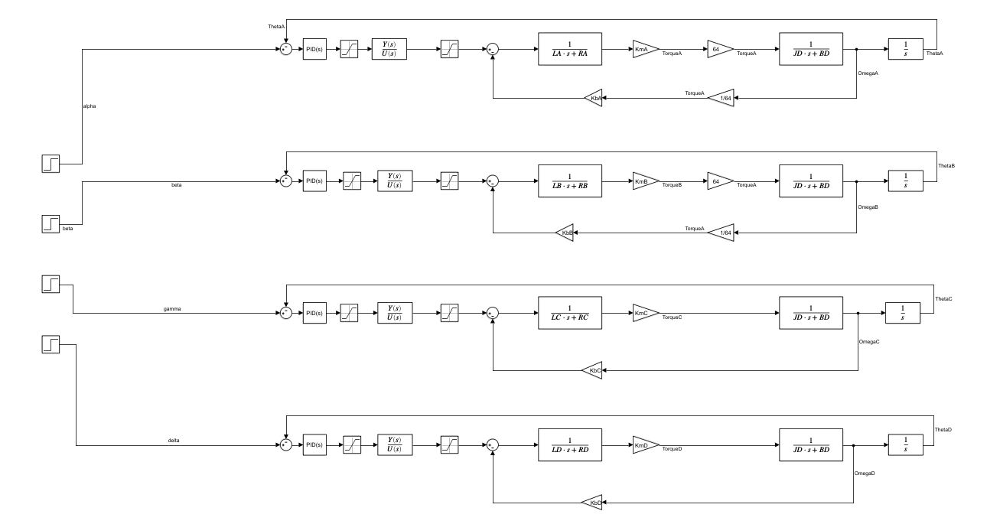
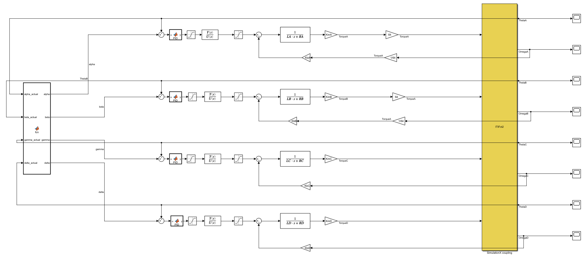
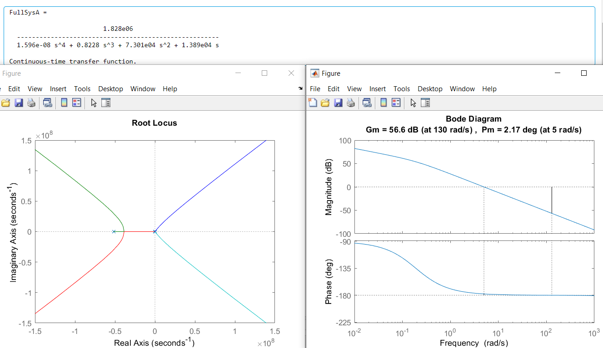
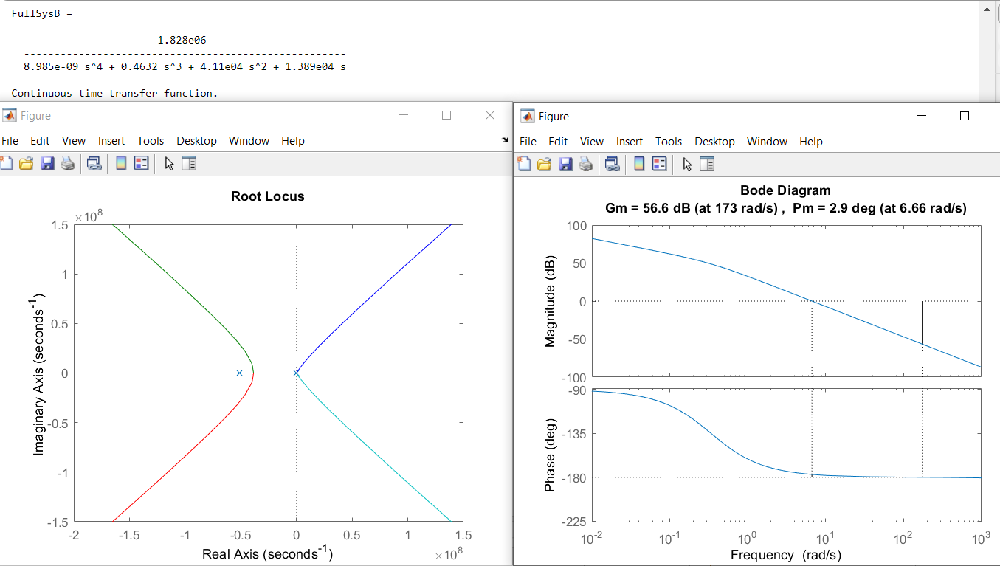
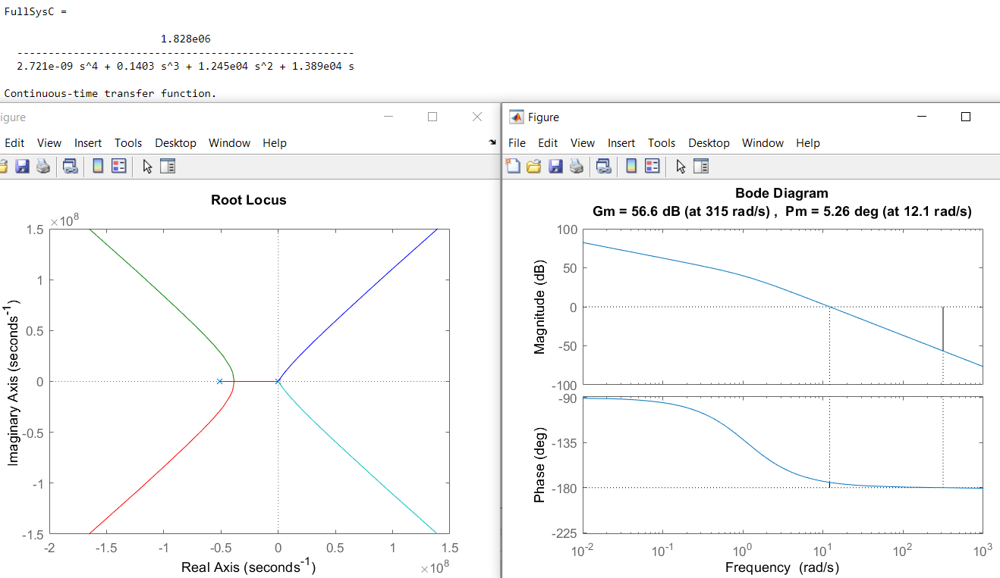
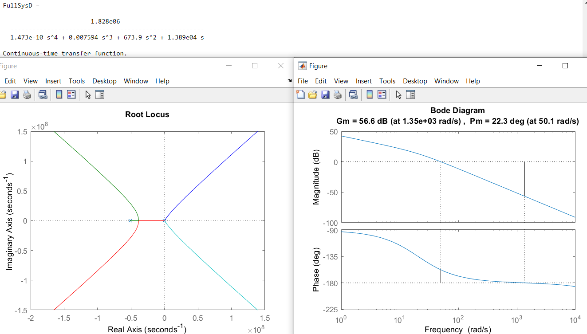

# Quality Control System

## ARMFLEX9000
## April 4, 2021
## Sajjad Al-Kazzaz, ECE, University of British Columbia
## Vancouver, BC, Canada

\newpage

### Table of Contents

- [Abstract](#Abstract)
- [Nomenclature](#Nomenclature)
- [Robotics](#1-robotics)
	- Figure 1.1
- [Modelling](#2-modelling)
- [Controller](#3-controller)
- [Tuning](#4-tuning)
- [Port to C](#5-port-to-c)
- [Performance](#6-performance)

### Abstract

ARMFLEX9000 is a 3.5 DOF arm that was developed for the purposes of quality control of marshmallows on a conveyor-belt. This paper will discuss some aspects of the design of the robot, as well as control of the robot. 

In this paper, Section 1 describes the robotics, including kinematics and path planning. Section 2 discusses robot modelling in Matlab and SimulationX. Section 3 describes the Matlab controller, this includes system control and PID implementation. Section 4 goes over PID tuning. Section 5 describes porting the controller to C. Finally, Section 6 will discuss system performance.

### Nomenclature

- DOF: Degrees of freedom
- PID: Proportional, integral, and derivative


### 1. Robotics

The first thing that had to be done for the robotics of the machine was object placement and path planning. This is a crucial step that determines the length of the arm and thereby the inertia and motors used. The requirements dictated that there should be 3 cylindrical marshmallows on the stopped conveyor which the arm must be able to pick-up and discard. The chosen final positioning was determined with the help of the Mechanical team and optimized for the best results; this positioning is shown in figure 1.1. Given this positioning the optimal arm joint lengths were found to be:

$$r_a = 0.13m$$
$$r_b = 0.09m$$


*Figure 1.1*

The dots on figure 1.1 represent the path stage of the arm, to be specific the x and y coordinates of motor C. The arm starts at the calibration stage. The arm then moves to the first alignment dot, also known as the garbage dot. This is so that the arm doesn't swing and knock over marshmallows in its initial movement. The arm then follows a set of alignment dots as it approaches a specific marshmallow so that a general path can be followed that won't knock over or tip other marshmallows. Each marshmallow has its own set of alignment dots shown in the figure by a line that connects said dots. Then the arm will go to the respective pick-up dot to grab the marshmallow, followed by retracing its steps through the alignment dots and then a return to the garbage dot. From the garbage dot the controller will determine whether another marshmallow needs to be grabbed, and follow the outlined stated above, or return home and wait for further commands.

In order to translate the motor C stage coordinates into angles that can be sent to the appropriate motors, a model for inverse kinematics had to be developed. Using trigonometry the position of motor C was translated from the cartesian coordinates of the dots into polar coordinates $\alpha$ and $\beta$ for motors A and B respectively. This was done using the following formulas:

$$\beta = \arccos{\frac{x^2 + y^2 + r_a^2 + r_b^2}{2r_a r_b}}$$
$$\alpha = \arctan{\frac{y}{x}} - \arctan{\frac{r_b \sin{\beta}}{r_a + r_b \cos{\beta}}}$$

To find the necessary angle, $\gamma$, for the swivel motor C so that it remained perpendicular to the conveyor, trigonometry was also used and the following formula was calculated:
$$\gamma = \alpha + \beta - \pi/2$$

Finally, the angle $\delta$ for motor D, which controls the pincher, was found from the design of the pincher to be 0 in the release position, and $\pi/2$ in the grab position. The necessary angle $\delta$ at any time is pre-determined by the stage or dot it is in, and is part of that stages coordinates.

No forward kinematics were used in the controller since the angles were already being calculated and could be used for error calculation. Turning measured angles into measured position was unnecessary and, therefore, removed to save processing time.

### 2. Modelling

Modelling the full system was done using Simulink and SimulationX for the purposes of testing. In Simulink, 4 motor models were developed using the standard motor model and feedback systems as reference. Figure 2.1 shows the 4 motor models, each with its own feedback path. The values for the motors electrical and mechanical components were obtained from the Electrical and Mechanical teams respectively. Using this model as a blueprint, the complete model made for tuning and demoing is shown in Figure 2.2. This model replaces the mechanical components with a communication block connected to SimulationX. SimulationX does the job of more accurately calculating mechanical components and their behaviour during simulation. Figure 2.2 also shows 4 instances of the PID Matlab functions in order to meet requirements, and a central controller (on the far left) that manages overall movement of the system. In SimulationX the Mechanical team developed a simplified model of the arm using the correct weights and lengths for all the components. A Matlab transfer function block is used to model the driver circuit for each of the motors, along with saturation blocks to ensure the voltage limitations of the components aren't exceeded.


*Figure 2.1*


*Figure 2.2*

### 3. Controller

There are two parts to the system control. The first is the user-defined Matlab function to replace a PID block. Figure 3.1 shows the complete code for the function. Persistent arrays and variables were used to maintain a history of previous error values for the filtered derivative and to keep track of the error sum for the integral output.

```
function y = PID(u)

persistent errorSum
persistent PrevDerivative
persistent ept
persistent Temp
Tsample = 1/500;
nhat = 16;               % Number of samples taken/kept
P = 4/(Tsample*nhat);                 % Pole
KP = 10;
KI = 5;
KD = 2;

% Initialize Temp
if isempty(Temp)
    Temp = 0;
end

% Initialize ept
if isempty(ept)
    ept = zeros(1, nhat);
    total = 0;
    for i = 1:nhat
        calc = P*exp(-P*i*Tsample);
        ept(i) = calc;
        total = total + calc;
    end
    scale = 1/(Tsample*total);
    ept = ept*scale;
end

% Initialize errorSum
if isempty(errorSum)
    errorSum = 0;
end

% Initialize PrevDerivative
if isempty(PrevDerivative)
    PrevDerivative = zeros(1,nhat);
end

% Calculate proportional output
ProportionalOutput = u*KP;

% Calculate integral output
errorSum = errorSum + u*Tsample;
IntegralOutput = errorSum*KI;

% Calculate derivative output
PrevDerivative(1) = (u - Temp);
DerivativeOutput = dot(ept, PrevDerivative)*KD;

% Take a step in time
for n = 1:(nhat - 1)
    PrevDerivative(nhat + 1 - n) = PrevDerivative(nhat - n);
end

% Update Temp
Temp = u;

% Sum all outputs and return,
y = ProportionalOutput + IntegralOutput + DerivativeOutput;
end
```
*Figure 3.1*

The second part of the system control is the system controller. This is a Matlab function that has the coordinates for all the stages relevant to each of the motors and a way of keeping track of which stage the system is in at any point in time. This controller also allows the user to choose which marshmallows to pick-up during the sequence. The complete function is shown in Figure 3.2. Each clock cycle the controller calculates the error between the desired, calculated angles and the true angles being read from SimulationX. Once the error for a particular stage drops below a threshold value, the controller considers that stage complete and increments to the next stage; if the completed stage was the last stage in a marshmallows set then the next marshmallow in the list is targeted. Once the last marshmallow in the list has finished its sequence, the controller sends the arm back to the home calibration position. 

```
function [alpha, beta, gamma, delta] = fcn(alpha_actual, beta_actual, gamma_actual, delta_actual)
% Constants
ra = 0.13;
rb = 0.09;
M1Coord = {[0.055, 0, pi/2], [0, 0.055, 0],     [0, 0.065, 0],     [0, 0.09, 0],     [0, 0.09, pi/2],     [0, 0.065, pi/2],     [0.055, 0, pi/2], [0.055, 0, 0]};
M2Coord = {[0.055, 0, pi/2], [0.055, 0.055, 0], [0.055, 0.065, 0], [0.055, 0.09, 0], [0.055, 0.09, pi/2], [0.055, 0.065, pi/2], [0.055, 0, pi/2], [0.055, 0, 0]};
M3Coord = {[0.055, 0, pi/2], [0.11, 0.055, 0],  [0.11, 0.065, 0],  [0.11, 0.09, 0],  [0.11, 0.09, pi/2],  [0.11, 0.065, pi/2], [0.055, 0, pi/2], [0.055, 0, 0]};
marshmallows = {M1Coord, M2Coord, M3Coord};

% Persistent
persistent completedMarshmallow
persistent completedStage

if isempty(completedMarshmallow)
    completedMarshmallow = 1;
end

if isempty(completedStage)
    completedStage = 1;
end

% Make sure some value exists JIC
alpha = 0;
beta = 0;
gamma = 0;
delta = 0;


% Which and how many marshmallows to grab
marshmallowGrab = [1, 2, 3];
marshmallowCount = 3;

if completedMarshmallow < marshmallowCount + 1
    % If we havent grabbed all the marshmallows then pick
    % completedMarshmallow
    currentMarshmallow = marshmallowGrab(completedMarshmallow);
    
    % Check if we have completed all stages
    if completedStage < 9
        % Set the target position
        xc = marshmallows{currentMarshmallow}{completedStage}(1);
        yc = marshmallows{currentMarshmallow}{completedStage}(2);
        delta = marshmallows{currentMarshmallow}{completedStage}(3);
    
        % Calculate required angles
        beta = acos((xc^2 + yc^2 - ra^2 - rb^2)/(2*ra*rb));

        alpha = atan(yc/xc) - atan((rb*sin(beta))/(ra + rb*cos(beta)));

        gamma = (alpha_actual + beta_actual - pi/2);
        
        % Check if we have reached target location (withing 2%)
        errorAlpha = abs(2*(alpha_actual - alpha)/(abs(alpha_actual) + abs(alpha)))
        errorBeta = abs(2*(beta_actual - beta)/(abs(beta_actual) + abs(beta)))
        errorGamma = (gamma_actual - gamma)
        errorDelta = (delta_actual - delta)
        
        if errorAlpha < 0.02 && errorBeta < 0.02 && errorGamma < 0.002 && errorDelta < 0.005
            % We have reached target position
            % Increment completedStage
            completedStage = completedStage + 1;
        end
    else
        % We have finished all stages so reset and go to next marshmallow
        completedStage = 1;
        completedMarshmallow = completedMarshmallow + 1;
    end
    
else
    % We have grabbed all marshmallow so we return to home
    alpha = 0;
    beta = 0;
    gamma = 0;
    delta = 0;
end


[alpha, beta, gamma, delta];
```
*Figure 3.2*

### 4. Tuning

To tune the system root locus and margin analysis tools were used to give a starting location. The open-loop transfer functions for each of the motors was obtained using the values and models developed in Section 2, Figure 1.2. As an estimation, the value for the controller frequency was chosen to be a very conservative 1000Hz. Thus, nhat, the number of samples used to calculate the filtered derivative, was chosen to be 10; this results in a filter pole of 400 for the purposes of testing. The root locus and margin graphs for the each of the 4 motors are shown in figures 4.1, 4.2, 4.3, and 4.4 respectively. Using this information a suitable starting location for the PID zeros was chosen for each of the motors and tested using the model from Section 2, Figure 1.3. Through trial and error each of the motors were tuned to achieve the desired results. The final PID values for all the motors are summarized in Table 1.1. 


*Figure 4.1*


*Figure 4.2*


*Figure 4.3*


*Figure 4.4*

*Table 1.1*

### 5. Port to C

Due to the similarities between Matlab and C porting the functions developed in Section 3 was fairly easy. Most of the code was copied straight from the Matlab functions and adjusted to meet the syntax requirements of C. Certain constants, like the arm lengths and their squares, are pre-calculated to reduce processing time. To further save processing time the array of cartesian coordinates for the stages of all the marshmallows are pre-translated to the polar coordinates for $\alpha$ and $\beta$ during setup so that these lengthy calculations aren't repeated during the actual interrupt routine. The complete arduino C code is shown in Figure 5.1.

```
#define TIMER_INTERRUPT_DEBUG 0

// Parameters:
// KP, KI, KD
double gainA[3] = {0.82, 0.008, 0.2};
double gainB[3] = {0.99, 0.01, 0.26};
double gainC[3] = {1, 0.0075, 0.2};
double gainD[3] = {2, 0.1, 0.08};
double ra = 0.13;
double rb = 0.09;
#define RaSquared 0.0169
#define RbSquared 0.0081
#define RaRb2 0.0234   // 2*ra*rb
#define HalfTurn 1.571 // Pi/2

// Timer
#define USE_TIMER_1 true
#define TIMER1_FREQ_HZ 3000

// Libraries
#include <math.h>
#include "TimerInterrupt.h"

const double Tsample = 1/3000;
const int nhat = 8;
const int P = 4/(Tsample*nhat);

// Pins:
int InputA = A1;        // Analog input pin for error
int InputB = A1;
int InputC = A1;
int InputD = A1;

int OutputA = A2;      // Analog output pin for the control signal
int OutputB = A3; 
int OutputC = A4; 
int OutputD = A6; 

// Coordinates:
double marshmallows[][8][3] = {\
{{0.055, 0, 0}, {0, 0.055, 0},     {0, 0.065, 0},     {0, 0.09, 0},     {0, 0.09, HalfTurn},     {0, 0.06, HalfTurn},     {0.055, 0, HalfTurn}, {0.055, 0, 0}}\
, {{0.055, 0, 0}, {0.055, 0.055, 0}, {0.055, 0.065, 0}, {0.055, 0.09, 0}, {0.055, 0.09, HalfTurn}, {0.055, 0.06, HalfTurn}, {0.055, 0, HalfTurn}, {0.055, 0, 0}}\
, {{0.055, 0, 0}, {0.11, 0.055, 0},  {0.11, 0.065, 0},  {0.11, 0.09, 0},  {0.11, 0.09, HalfTurn},  {0.11, 0.065, HalfTurn}, {0.055, 0, HalfTurn}, {0.055, 0, 0}}};

// Persistent:
double PrevDerivativeA[nhat] = {0};
double PrevDerivativeB[nhat] = {0};
double PrevDerivativeC[nhat] = {0};
double PrevDerivativeD[nhat] = {0};
double ept[nhat];
double Temp = 0; 
int completedMarshmallow = 0;
int completedStage = 0;
double errorSumA = 0;
double errorSumB = 0;
double errorSumC = 0;
double errorSumD = 0;

// Functions
void PID(int out, double error, double errorSum, double gain[], double PrevDerivative[]) {
  // Proportional
  double ProportionalOutput = gain[0]*error;

  // Integral
  errorSum += error*Tsample;
  double IntegralOutput = gain[1]*errorSum;

  // Filtered derivative
  PrevDerivative[0] = error - Temp;
  
  // Derivative output
  double DerivativeOutput = 0;
  // Dot product
  for(int n=0; n<nhat; n++) {
    DerivativeOutput += PrevDerivative[n]*ept[n];
  }
  
  // Shift PrevDerivative:
  for(int n=0; n<=nhat-1; n++){
    PrevDerivative[nhat + 1 - n] = PrevDerivative[nhat - n];
  }
  
  // Update Temp
  Temp = error;

  // Output
  analogWrite(out, ProportionalOutput + IntegralOutput + DerivativeOutput*gain[2]);
}


void Controller() {
  // Which and how many marshmallows are we grabbing
  int marshmallowGrab[] = {1, 2, 3};
  int marshmallowCount = 3;

  // Read values
  double alpha_actual = analogRead(InputA);
  double beta_actual = analogRead(InputB);
  double gamma_actual = analogRead(InputC);
  double delta_actual = analogRead(InputD);

  if(completedMarshmallow < marshmallowCount) {
    // If we havent grabbed all the marshmallows then pick
    // completedMarshmallow
    int currentMarshmallow = marshmallowGrab[completedMarshmallow];

    if(completedStage < 8) {
      // Set the target position
      double alpha = marshmallows[currentMarshmallow][completedStage][1];
      double beta = marshmallows[currentMarshmallow][completedStage][2];
      double delta = marshmallows[currentMarshmallow][completedStage][3];

      double gamma = (alpha_actual + beta_actual - HalfTurn);

      // Check if we have reached target location (withing 2%)
      double errorAlpha = (alpha_actual - alpha);
      double errorBeta = (beta_actual - beta);
      double errorGamma = (gamma_actual - gamma);
      double errorDelta = (delta_actual - delta);
      
      if(errorAlpha < 0.05 && errorBeta < 0.05 && errorGamma < 0.002 && errorDelta < 0.005) {
        // We have reached target position
        // Increment completedStage
        completedStage++;
      }
      else {
        PID(OutputA, errorAlpha, errorSumA, gainA, PrevDerivativeA);
        PID(OutputB, errorBeta, errorSumB, gainB, PrevDerivativeB);
        PID(OutputC, errorGamma, errorSumC, gainC, PrevDerivativeC);
        PID(OutputD, errorDelta, errorSumD, gainD, PrevDerivativeD);
      }
    }
    else {
      completedStage = 0;
      completedMarshmallow++;
    } 
  }
  else {
    // We are done grabbing, go home and callobrate
    double alpha = 0;
    double beta = 0;
    double gamma = 0;
    double delta = 0;

    // Check if we have reached target location (withing 2%)
    double errorAlpha = (alpha_actual - alpha);
    double errorBeta = (beta_actual - beta);
    double errorGamma = (gamma_actual - gamma);
    double errorDelta = (delta_actual - delta);

    // Call PID
    PID(OutputA, errorAlpha, errorSumA, gainA, PrevDerivativeA);
    PID(OutputB, errorBeta, errorSumB, gainB, PrevDerivativeB);
    PID(OutputC, errorGamma, errorSumC, gainC, PrevDerivativeC);
    PID(OutputD, errorDelta, errorSumD, gainD, PrevDerivativeD);
  }
}

void setup() {
  pinMode(InputA, INPUT);
  pinMode(InputB, INPUT);
  pinMode(InputC, INPUT);
  pinMode(InputD, INPUT);
  
  pinMode(OutputA, OUTPUT);
  pinMode(OutputB, OUTPUT);
  pinMode(OutputC, OUTPUT);
  pinMode(OutputD, OUTPUT);

  // Initialize ept
  if(ept == NULL) {
    int total = 0;
    for(int i=0; i<=nhat; i++){
      ept[i] = P*exp(-P*i*Tsample);
      total = total + ept[i];
    }
    for(int i=0; i<=nhat; i++){
      ept[i] = ept[i]*(1/(Tsample*total))*Tsample;  // Double check
    }
  }

  // Convert to polar
  // For each marshmallow
  for(int i=0; i<3;i++){
    // For each stage
    for(int j=0; j<8;j++){
      double xc = marshmallows[i][j][1];
      double yc = marshmallows[i][j][2];

      // Calculate required angles
      double beta = acos((pow(xc, 2) + pow(yc, 2) - RaSquared - RbSquared)/(RaRb2));

      double alpha = atan(yc/xc) - atan((rb*sin(beta))/(ra + rb*cos(beta)));

      // Replace xc and yc with alpha and beta
      marshmallows[i][j][1] = alpha;
      marshmallows[i][j][2] = beta;
    }
  }
  
  // Initialize interrupt on timer1
  ITimer1.init();
  if (ITimer1.attachInterrupt(TIMER1_FREQ_HZ, Controller))
    Serial.println("Starting  ITimer0 OK, millis() = " + String(millis()));
  else
    Serial.println("Can't set ITimer0. Select another freq. or timer");
}

void loop() {
}
```
*Figure 5.1*

### 6. Performance

The overall arm performance is very fast; in order to pick up all three marshmallows requires just over 10s, picking up any 2 marshmallows requires 7.5s, and picking up just one marshmallow takes 5s. Assuming the probability that any one marshmallow needs to be discarded is 50%, then the expected run time of the arm is 5.94s. Even with the speed the arm moves at there is no overshoot or tipping of any marshmallows.

The processing time of the ISR routine was calculated from the arduino code in Section 5 using the standard clock rates provided. The ISR requires 2207 clock cycles to run. The Leonardo has a clock speed of 16Mhz, therefore, after the controller can run at a maximum of 7250Hz. However, to account for possible delays and errors the controller frequency is set to 7250/2 ~ 3600Hz. The only cost involved in this part of the project is that of the arduino itself which is about $25.
