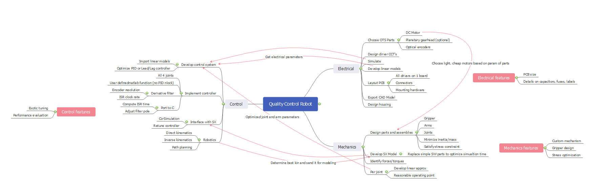
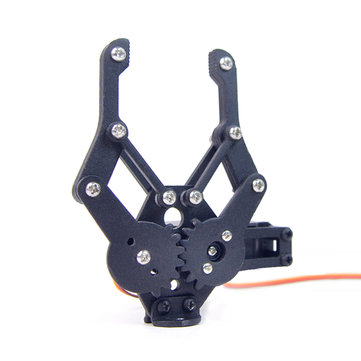
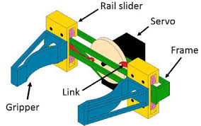

# ARMFLEX9000

*Mind map of RCG of the project*

[Project RCG outline](e391Proj2021.pdf)

## Outline of what needs to get done

- Mech should figure out mass and distance requirements for arms and joints
	- Minimize inertia and mass, cost (both in material and in motor)
	- Work with Control to figure out kinematics of arms
	- Develop linear models
- Mech and Elec must collaborate to choose DC motor that fit the necessary length and weight joints and assemblies.
	- 3 motors for the 3 DOF arms
	- 1 motor for the gripper (see gripper design below)
- Elec should develop drivers (4) for all the motors and place them on one PCB
	- Choose optimal optical encoders
	- Mounting hardware and enclosure needed
	- Develop linear model
- Control needs Elec and Mech parameters and linear models
	- Path planning and kinematics for Mech arms
	- Develop matlab controller with PID
	- Build simulink models
	- PID tune the 4 motors for speed and stability

## Mechanics

### Parts and assemblies:

#### Path layout and distances 

I have sketched a rough design of what the path might look like based on the size of the marshmallows and the given statements. Each marshmallow is 3cm in diameter, the track they are on is chosen to be 6cm (1.5cm space between either edge), and marshmallow access is 6 with spacing of 1cm edge to edge in between and a total length of 0.24cm. The garbage shoot will be 10cm by 20cm and 5cm away from the assembly.

{ width: 800px; }

#### Inertia, arms, and motors

The marshmallows mass is negligible and so the focus for the inertia will be the mass of the arms and the motors at the joints. A choice of light metal arms and small motors will reduce cost and make control easier.

#### Gripper

There are two easy options that come to mind first. I believe gripper slide works better for the assembly style sliding we will be doing.

{ width: 800px; } 

{ width: 800px; }

## Control

### Robotics

#### Kinematics

I have chosen to build a serial arm robot with 3 main DOF. The direct and inverse kinematics for the system will be built using a standard coordinate system outlined in [Path layout and distances](#Path-layout-and-distances). Optimal lengths of arms will be discussed with Mech.

#### Path planning

Initial ideas include possibly only bending in one angle for easier/faster coding. Steps followed by arm:

1. Go from fixed position to specified first marshmallow
2. Grab marshmallow
3. Pull out (avoid other marshmallows, possibly increase spacing to accommodate)
4. Bend in specified angle quickly and release gripper to discard marshmallow
5. Return to fixed position if there is no other task, else go to task 1

### Controller

#### Matlab function

A matlab function preforming the controller role in our robot. Refer to video on coding a controller.

- Derivative filter
- Encoder resolution
- ISR clock rate

#### Simulink model

- Import linear models from Elec and Mech
